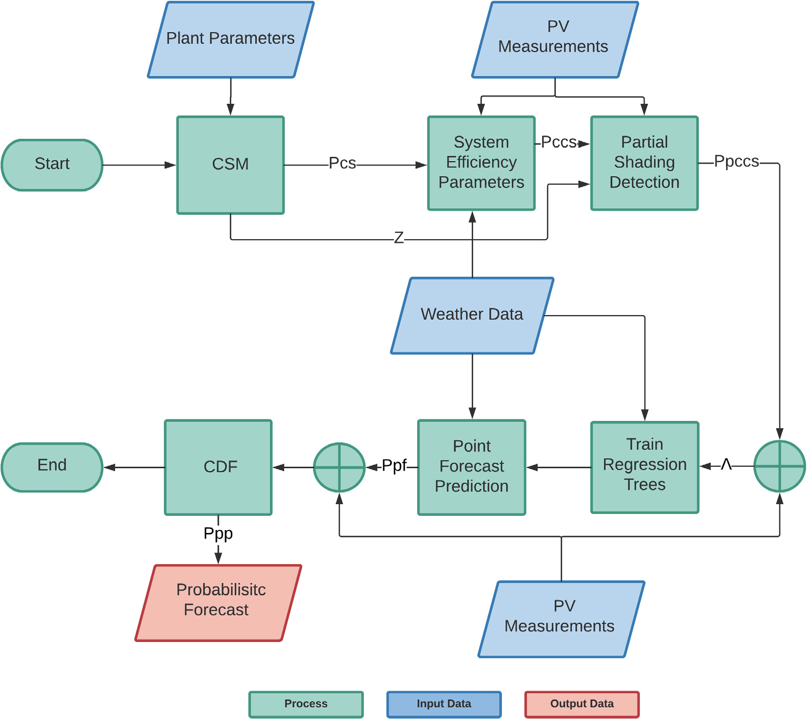

# solar_forecasting
This repository contains code, example notebooks, data, and resources for developing and running a probabilistic solar-power forecasting model based on the paper 'Day-ahead probabilistic PV generation forecast for buildings energy'
management systems'

- **Data preprocessing** pipelines  
- **Exploratory notebooks** demonstrating feature engineering and model evaluation  
- **Scripts** for training, evaluating, and deploying a forecasting model  
- **Resources** such as configuration files or pre-trained weights (if available)

---

## Getting started
Follow these steps to quickly set up and run the solar forecasting module:

1. **Clone the Repository**
   ```bash
   git clone git@gitlab.lrz.de:energy-management-technologies-public/intelligent/prediction-module/solar_forecasting.git
   cd solar_forecasting

2. **Install Poetry (if not already installed)**
   ```bash
   curl -sSL https://install.python-poetry.org | python3 -
   export PATH="$HOME/.local/bin:$PATH"
   ```

3. **Install Dependencies with Poetry**
   ```bash
   poetry install
   ```

   This will:
   - Create a virtual environment managed by Poetry.
   - Install all required packages as specified in `pyproject.toml`.

4. **Activate the Poetry Shell**
   ```bash
   poetry shell
   ```
---

## Development

If you plan to extend or modify this repository, follow these guidelines:

1. **Code Style**  
   - Adhere to [PEP 8](https://www.python.org/dev/peps/pep-0008/) for Python style.  
   - Run a linter (e.g., `flake8`) before submitting code.  
   - Use [Black](https://github.com/psf/black) or [isort](https://github.com/PyCQA/isort) for automated formatting, if desired.

2. **Branching & Git Workflow**  
   - Create a new branch per feature or bugfix (e.g., `feature/add-lstm-model`, `bugfix/fix-data-loader`).  
   - Commit messages should be descriptive, prefixed with the ticket/issue number if applicable (e.g., `[#123] Add data validation checks`).  
   - Open merge requests (MRs) against `main` (or your primary integration branch) once your feature is ready for review.

3. **Configuration**  
   - Most hyperparameters, file paths, and model options are controlled via `resources/config.yaml`.  
   - To add a new configuration key, edit `resources/config.yaml` and update any code that reads from it (e.g., in `train.py`).

4. **Running Tests** (If Tests Exist)  
   > _If you add unit tests, consider placing them under a `tests/` folder. Use `pytest` to run all tests:_  
   ```bash
   pytest tests/
   ```

5. **Adding New Dependencies**  
   - Whenever a new library is required, add it using poetry  
   - Then run:  
     ```bash
     poetry add library
     ```

6. **Data Management**  
   - **Raw data** should go in `data/raw/`.  
   - **Intermediate/processed data** should go in `data/processed/`.  
   - Do **not** commit large datasets: instead, update `.gitignore` so only small CSVs or example files are tracked.

---
## Usage
Below are common workflows for preparing the data, training the models, and evaluating the results.

### 1. Data Preparation

Before training, place your raw time-series data under `data/raw/`. Example files might include:

- `data/raw/pv_power_generation.csv`  
- `data/raw/weather_data.csv` 

To get the raw weather data run the notebook `weather_data_exploration`
To get the raw pv power generation use the website `https://www.renewables.ninja/`
Then to merge the raw data use the `merge_data_exploration` notebook.

This script will:
1. Read raw CSVs  
2. Clean missing values, resample time series, merge sources  
3. Output merged file into `data/processed/`  

### 2. Training a Model

Once the processed data is ready, run each step of the model. 

To run these steps you can use the scripts or run the notebook `train_pv_forecasting.ipynb`

### 3. Evaluating Model Performance

After training the model you can evaluate the point forecast step and the probabilistic forecast use the following notebooks.

1. evaluation_point_forecasting.ipynb
2. evaluation_probabilistic_forecast.ipynb

---
**License:**  
This project is licensed under the [MIT License](LICENSE). You are free to use, modify, and distribute it under the terms of that license.  